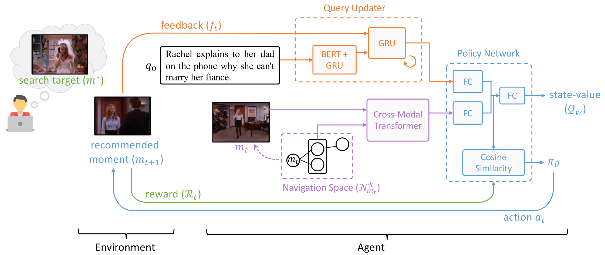

# iVCMR: Interactive Video Corpus Moment Retrieval using Reinforcement Learning
PyTorch implementation of ACM Multimedia 2022 paper "[Interactive Video Corpus Moment Retrieval using Reinforcement Learning](https://arxiv.org/abs/2302.09522)"

## Task Definition

A user issues a natural language query and is provided with a ranked list of candidate moments retrieved by a search engine. The navigation of the target moment starts when the user selects a moment for browsing. Denote the user query as $q_0$ and the selected moment as $m_0$. The goal is to plan for a navigation path that reaches the target moment $m^\*$ from $m_0$ within a limited number of time steps. Specifically, along the path, the system recommends a moment for browsing while the user provides keyword-based feedback specifying either a missing or irrelevant concept at the moment. Based on the feedback, the navigation path is adjusted dynamically in every step and the system takes an action that ideally shortens the time step required to reach $m^*$.

## Model Overview
iVCMR:
+ Policy Network
+ Query Updater
+ Environment



## Getting Start

### Prerequisites
1. Clone this repo
```
git clone https://github.com/zhixinma/iVCMR
cd iVCMR
```

2. Data Preparation

The data can be found [here](https://smu-my.sharepoint.com/:f:/g/personal/zxma_2020_phdcs_smu_edu_sg/ElJzK_VKYp1AlHEsS0DkSA4BV0rTTUwUyZ28ls5e--dwzQ?e=XBBVNn) and are organized as follows:

```
ckpt
├── tvr_v8m01Ea2c01_step_penalty5_best_acc
└── tvr_v8m01nEnqu_best_acc

feature
├── tvr_dual_task_concept_p3_2048.h5
├── tvr_dual_task_emb_concept_p3_2048_concept_bank.txt
├── tvr_dual_task_emb_concept_p3_2048_vid_id.txt
└── tvr_dual_task_emb_p3_2048.h5

graph
└── tvr_balanced_graph_ths_0.99_thx_0.70_wc_0.80_ws_0.20_tok_10.gpickle

data
├── train_vt_clip_level_env_trans_wc_0.80_ws_0.20_ths_0.99_thx_0.70_top_10_lmdb
├── train_vt_clip_level_input_conquer_wc_0.80_ws_0.20_ths_0.99_thx_0.70_top_10_lmdb
├── train_vt_clip_level_input_hero_wc_0.80_ws_0.20_ths_0.99_thx_0.70_top_10_lmdb
├── train_vt_clip_level_input_wc_0.80_ws_0.20_ths_0.99_thx_0.70_top_10_lmdb
├── train_vt_clip_level_moment_distance_wc_0.80_ws_0.20_ths_0.99_thx_0.70_top_10_lmdb
├── train_vt_clip_level_moment_feat_wc_0.80_ws_0.20_ths_0.99_thx_0.70_top_10_lmdb
├── train_vt_clip_level_unit_fea_lmdb
├── train_vt_clip_level_unit_fea_weighted_wc_0.80_ws_0.20_ths_0.99_thx_0.70_top_10_lmdb
├── train_vt_clip_level_vr_input_wc_0.80_ws_0.20_ths_0.99_thx_0.70_top_10_lmdb
├── train_vt_graph_neighbors_in_k_3_wc_0.80_ws_0.20_ths_0.99_thx_0.70_top_10_lmdb
├── train_vt_graph_neighbors_in_k_4_wc_0.80_ws_0.20_ths_0.99_thx_0.70_top_10_lmdb
├── train_vt_graph_neighbors_in_k_5_wc_0.80_ws_0.20_ths_0.99_thx_0.70_top_10_lmdb
└── train_vt_graph_neighbors_in_k_6_wc_0.80_ws_0.20_ths_0.99_thx_0.70_top_10_lmdb
```

3. Requirements

The required packages are as follows:
```
networkx==2.5.1
numpy==1.19.5
pytorch==1.10.0
cudatoolkit==11.3
scikit-learn==0.24.2
scipy==1.5.4
matplotlib==3.3.4
tqdm==4.62.3
h5py==2.9.0
transformer==4.12.5
lmdb==0.97
msgpack==1.0.2
msgpack-numpy==0.4.7.1
nltk==3.6.7
```
The exported conda environment ```iVCMR.yml``` can be found [here](./envs/iVCMR.yml). Then the environment can be created by:

```conda env create -f iVCMR.yml```

### Training and Inference

#### Inference
A2C approach (Ours): The model checkpoint ```tvr_v8m01Ea2c01_step_penalty5_best_acc``` can be downloaded from [here](https://smu-my.sharepoint.com/:f:/g/personal/zxma_2020_phdcs_smu_edu_sg/ElJzK_VKYp1AlHEsS0DkSA4BV0rTTUwUyZ28ls5e--dwzQ?e=XBBVNn).
```
python -u main.py --mode infer --dataset tvr \
--data_root /path/to/data --ckpt_root /path/to/ckpt \
--feature_root /path/to/feature --graph_root /path/to/graph \
--edge_threshold_single 0.99 --edge_threshold_cross 0.70 --alpha 0.9 --weight_concept 0.8 --weight_subtitle 0.2 \
--transition policy --feature_type vt --reward_signal step --batch_size 16 --task ivcml --infer_steps 7 --k_for_nk 3 --use_balanced_graph --k_ei 10 \
--wo_replacement --training_prefix tvr_v8m01Ea2c01_step_penalty5
```

W/o query updating: The model checkpoint ```tvr_v8m01nEnqu_best_acc``` can be downloaded from [here](https://smu-my.sharepoint.com/:f:/g/personal/zxma_2020_phdcs_smu_edu_sg/ElJzK_VKYp1AlHEsS0DkSA4BV0rTTUwUyZ28ls5e--dwzQ?e=XBBVNn).
```
python -u main.py --mode infer --dataset tvr \
--data_root /path/to/data --ckpt_root /path/to/ckpt \
--feature_root /path/to/feature --graph_root /path/to/graph \
--edge_threshold_single 0.99 --edge_threshold_cross 0.70 --alpha 0.9 --weight_concept 0.8 --weight_subtitle 0.2 \
--transition policy --feature_type vt --batch_size 16 --task ivcml --infer_steps 7 --drop_graph --k_for_nk 3 --use_balanced_graph --k_ei 10 \
--wo_replacement --training_prefix tvr_v8m01nEnqu
```

#### Training
```
python -u main.py --mode train --dataset tvr \
--data_root /path/to/data --ckpt_root /path/to/ckpt \
--feature_root /path/to/feature --graph_root /path/to/graph \
--edge_threshold_single 0.99 --edge_threshold_cross 0.70 --alpha 0.9 --weight_concept 0.8 --weight_subtitle 0.2 \
--init_lr 0.001 --gamma 0.8 --gae_lambda 0.3 --phi 0.01 --ent_coef 0.1 --vf_coef 0.1 --transition policy --feature_type vt --reward_signal step \
--loss_func triplet,a2c --margin 0.1 --loss_weight 0.9,0.1 --batch_size 16 --task ivcml --infer_steps 7 --k_for_nk 3 --use_balanced_graph --k_ei 10 \
--wo_replacement --training_prefix tvr_v8m01Ea2c01_step_penalty5_test
```


## Citation
If you find this code useful for your research, please cite our paper:
```
@inproceedings{ma2022ivcmr,
author = {Ma, Zhixin and Ngo, Chong Wah},
title = {Interactive Video Corpus Moment Retrieval Using Reinforcement Learning},
year = {2022},
isbn = {9781450392037},
publisher = {Association for Computing Machinery},
address = {New York, NY, USA},
url = {https://doi.org/10.1145/3503161.3548277},
doi = {10.1145/3503161.3548277},
pages = {296–306},
numpages = {11},
keywords = {interactive search, video corpus moment retrieval, user simulation, reinforcement learning},
location = {Lisboa, Portugal},
series = {MM '22}
}
```
